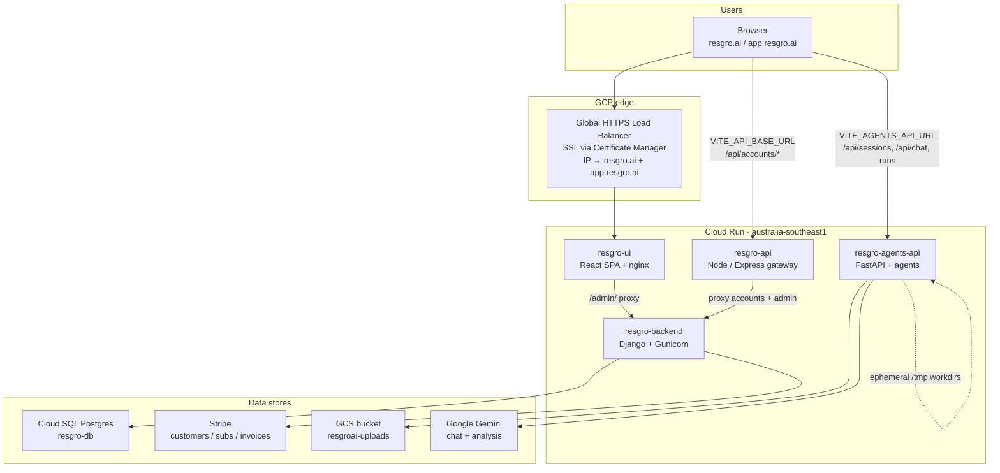
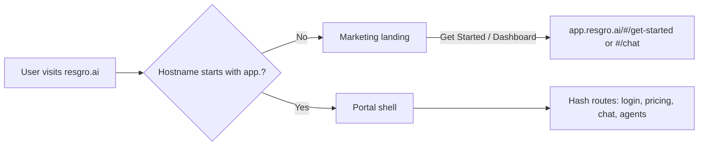
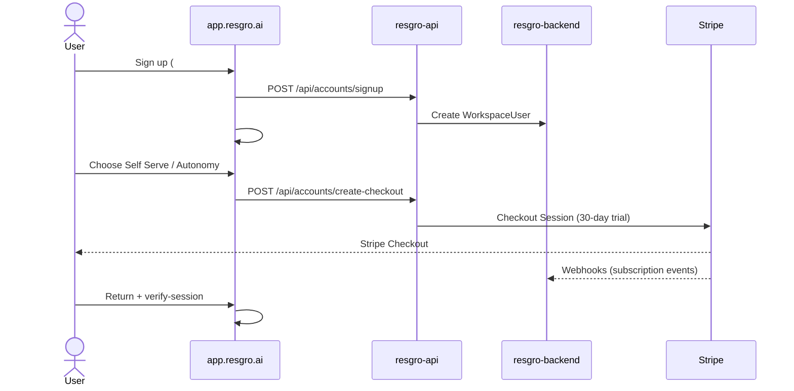
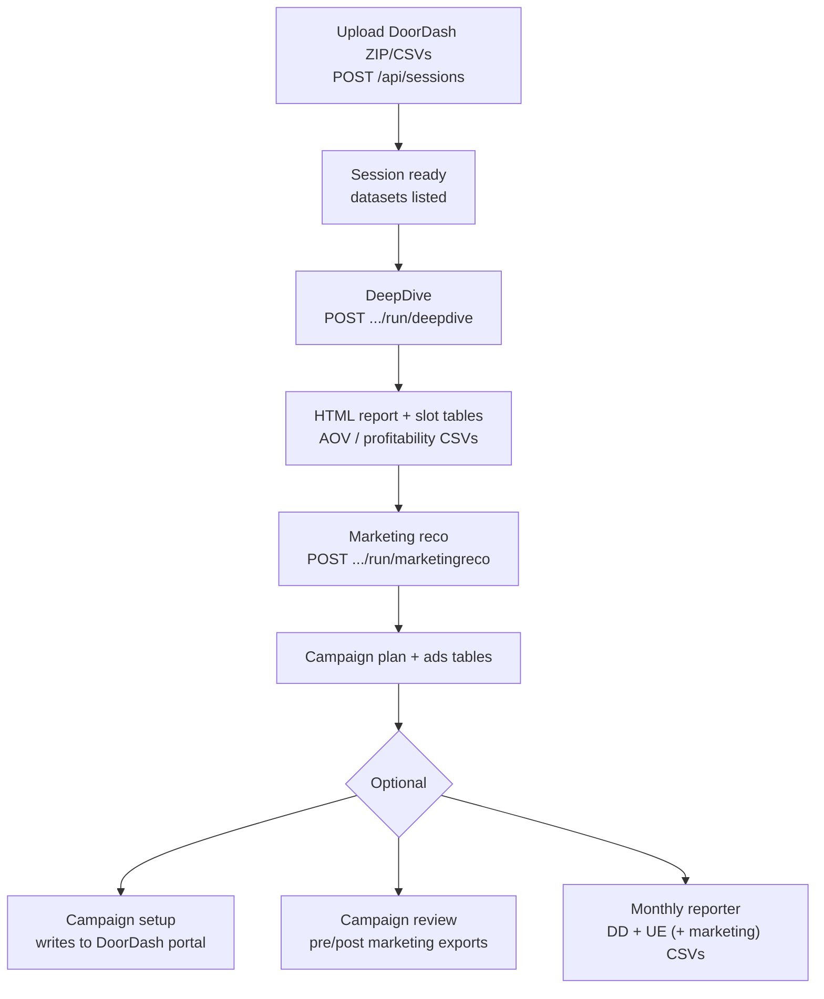
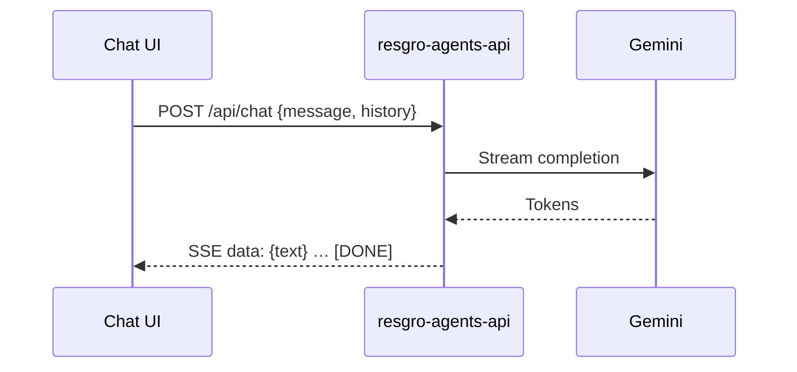
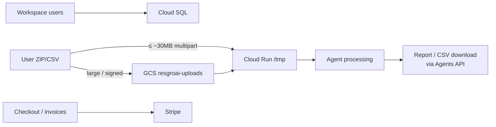
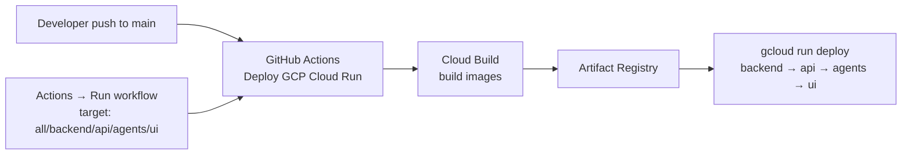

# ResGro AI — Platform Overview for the Team

**Audience:** engineers, PMs, and ops onboarding to ResGro  
**Last updated:** July 2026  
**Production region:** Google Cloud `australia-southeast1` (Sydney)  
**Repo:** [github.com/nhancio/ResGro-AI](https://github.com/nhancio/ResGro-AI)

This document explains **what ResGro is**, **how the system is built**, **how data and money flow**, and **how we deploy**. For day-to-day product usage (slash commands, file formats), see also [`RESGRO_APP_HOWTO_GUIDE.md`](./RESGRO_APP_HOWTO_GUIDE.md).

---

## 1. What ResGro does

ResGro AI is an **AI-powered growth workspace for Australian restaurants** that sell on delivery platforms (primarily **DoorDash**, also **Uber Eats** in monthly reporting).

Operators can:

| Capability | Outcome |
|------------|---------|
| **AI chat** | Ask ops / marketing questions grounded in the product |
| **Data sessions** | Upload DoorDash exports (or pull via automation) once, reuse across agents |
| **DeepDive** | Financial + marketing performance analysis + HTML report |
| **Marketing recommendations** | Campaign / ads plans derived from DeepDive tables |
| **Campaign review** | Pre/post marketing performance review |
| **Campaign setup** | Write offers / ads into DoorDash Merchant Portal (browser automation) |
| **Monthly reporter** | KPI pack across DoorDash + Uber Eats (+ marketing) |
| **Boss pipeline** | Orchestrate several agents end-to-end |

**Primary signed-in UX:** Chat workspace on `app.resgro.ai`  
**Marketing site:** Landing page on `resgro.ai`

---

## 2. Live production URLs

| Surface | URL |
|---------|-----|
| Marketing / landing | https://resgro.ai |
| App / portal | https://app.resgro.ai |
| Auth & Stripe gateway | https://resgro-api-naawlb2ghq-ts.a.run.app |
| Agents API | https://resgro-agents-api-naawlb2ghq-ts.a.run.app |
| Django (users / admin) | https://resgro-backend-naawlb2ghq-ts.a.run.app |
| Demo login | `demouser@resgro.ai` / `demo@123` |

> **Note:** Older docs and some code fallbacks still mention `us-west2` / Netlify. **Production traffic is Australia Cloud Run + HTTPS load balancer**, not Netlify and not a Compute Engine VM.

---

## 3. High-level architecture



### Service responsibilities

| Cloud Run service | Code | Responsibility |
|-------------------|------|----------------|
| **resgro-ui** | `resgro-landing/` | Static SPA. Same build serves landing *and* portal (host-based). |
| **resgro-api** | `apis/http/` | Public auth/billing gateway; proxies `/api/accounts/*` to Django; Stripe checkout orchestration entry for the browser. |
| **resgro-backend** | `backend/` | Workspace users, Stripe sync/webhooks, chat-session APIs, Django admin. |
| **resgro-agents-api** | `api/` + `agents/` | Sessions, DeepDive, marketing reco, campaign review/setup, monthly reporter, chat SSE, GCS signed uploads. |

---

## 4. Host split: landing vs app

One frontend build, two hostnames (`resgro-landing/src/config/app.ts`, `App.tsx`):

| Host | Mode | Behaviour |
|------|------|-----------|
| `resgro.ai` | Marketing | Landing sections (Hero, Solution, CTA…). “Get Started” opens **app** via `openPortal()`. |
| `app.resgro.ai` | Portal | Login, pricing, chat workspace, agents. |



**Important:** Do **not** set `VITE_FORCE_APP_HOST=true` in production — that forces portal UI on the marketing domain.

---

## 5. Tech stack

| Layer | Technologies |
|-------|----------------|
| **Frontend** | React 18, Vite 6, Tailwind CSS, Motion, EmailJS client |
| **UI hosting** | nginx on Cloud Run |
| **Auth / billing gateway** | Node.js, Express |
| **Accounts DB API** | Django 5, Django REST Framework, Gunicorn, WhiteNoise |
| **Agents API** | Python 3.11, FastAPI, Uvicorn, Pandas, NumPy, openpyxl |
| **AI** | Google Gemini (`GEMINI_API_KEY`) — streaming chat + analysis helpers |
| **Automation** | Playwright / browser-use (DoorDash Merchant Portal) |
| **Payments** | Stripe Checkout + Customer Portal + webhooks |
| **Cloud** | Cloud Run, Cloud Build, Artifact Registry, Cloud SQL (Postgres 15), GCS, Global HTTPS LB, Certificate Manager |
| **CI/CD** | GitHub Actions → `./gcp_deploy.sh --cloudbuild …` |
| **Contracts** | JSON schemas under `contracts/` + Pydantic models |

---

## 6. Repository map

```
ResGro-AI/
├── resgro-landing/     # React SPA (landing + portal)
├── apis/http/          # Node gateway → Cloud Run resgro-api
├── backend/            # Django → Cloud Run resgro-backend
├── api/                # FastAPI entry → Cloud Run resgro-agents-api
├── agents/             # DeepDive, marketingreco, campaign_*, monthly_reporter, boss, browser automation
├── shared/             # data_session, shared models/utils
├── contracts/          # Agent I/O contracts
├── orchestrator/       # Pipeline coordination helpers
├── docs/               # This file + how-to + deploy docs
├── scripts/            # GCS setup, tunnels
├── sample_data/        # DoorDash export fixtures for testing
├── tests/              # Pytest (mostly unit/mocked)
├── gcp_deploy.sh       # ★ Production deploy script (AU)
└── .github/workflows/deploy-gcp.yml
```

---

## 7. End-to-end user journeys

### 7.1 Sign up → pay → enter workspace



**Plans (as shown in product):** Self Serve ~AUD 100/mo · Autonomy ~AUD 250/mo · 30-day trial.  
Workspace access when subscription status is `trialing`, `active`, or `past_due`.

### 7.2 Analysis workflow (manual uploads)



### 7.3 Chat



---

## 8. Agent catalogue (API workflows)

Agents are invoked against a **session** (preferred) or as one-shot runs. Core HTTP surface: `api/main.py`.

| Agent | Typical trigger | Inputs | Outputs |
|-------|-----------------|--------|---------|
| **Data / Session** | `POST /api/sessions` | ZIP/CSV exports or autopilot DoorDash creds | `session_id`, dataset list |
| **DeepDive** | `.../run/deepdive` | Financial (+ optional sales/ops/marketing) in session | HTML report, summary metrics, slot CSVs, `run_id` |
| **Marketing reco** | `.../run/marketingreco` | Session with financial / DeepDive context | Recommended campaigns, ads tables |
| **Campaign review** | `.../run/campaign-review` | Marketing exports in session | Pre/post metrics per campaign/channel |
| **Monthly reporter** | `.../run/monthly-reporter` | Date ranges + DD/UE(/marketing) data | Summary + Excel downloads |
| **Campaign setup** | `.../run/campaign-setup` | Approved plan + DoorDash credentials | Portal write status (**live side effects**) |
| **Boss** | `.../run/boss` | Exports + credentials | Orchestrated multi-step status |
| **Chat** | `POST /api/chat` | Message + history | SSE stream |

**Large files (> ~30 MB total):** browser uses signed URL flow → **GCS** (`POST /api/uploads/sign` → PUT → `*/from-gcs`). See `api/gcs_uploads.py`.

**Caution:** Campaign Setup and Boss can **mutate** the real DoorDash Merchant Portal. Use approved plans and the correct account.

---

## 9. Where data lives

| Data | Store | Durable? |
|------|--------|----------|
| Users, subscriptions links, server chat sessions | **Cloud SQL** Postgres (`resgro-db`) | Yes |
| Large uploads (staging) | **GCS** `gs://resgroai-uploads/uploads/…` | Yes (until cleaned) |
| Small direct uploads + agent workdirs | Cloud Run **`/tmp`** | **No** — lost on scale-to-zero / new revision |
| Generated reports (HTML/Excel) while serving | Ephemeral on agents container | **No** (re-run agent to regenerate) |
| Payments / invoices | **Stripe** | Yes |
| Browser login UX state | `localStorage` on `app.resgro.ai` | Per-browser |



---

## 10. Auth & billing building blocks

| Concern | Implementation |
|---------|----------------|
| Browser → API | `resgro-landing/src/config/authApi.ts`, `stripe.ts` → `VITE_API_BASE_URL` |
| Gateway | `apis/http/server.js` maps `/api/accounts/*` and legacy Netlify-style paths to Django |
| Django accounts | `backend/accounts/` — signup, login, checkout, webhooks, billing portal |
| Demo user | Seeded `demouser@resgro.ai` with synthetic paid subscription for demos |
| Admin | Django admin (superuser); UI may deep-link `/admin/` via nginx/api proxy |

---

## 11. Deployment & CI/CD

### Environments

| Item | Value |
|------|--------|
| GCP project | `resgroai` |
| Region | `australia-southeast1` |
| Artifact Registry | `australia-southeast1-docker.pkg.dev/resgroai/resgro` |
| Domains | HTTPS LB → `resgro-ui` (custom domains stay on LB; CI only updates Cloud Run images) |

### Pipeline



- Workflow: `.github/workflows/deploy-gcp.yml`
- Script: `./gcp_deploy.sh --cloudbuild {all|backend|api|agents|ui}`
- Secrets: `GCP_SA_KEY`, `RESGRO_ENV` (full prod `.env`), optional `GCP_PROJECT_ID` / `GCP_REGION`
- Docs: [`GITHUB_ACTIONS_DEPLOY.md`](./GITHUB_ACTIONS_DEPLOY.md)

### Typical service sizing (from deploy script)

| Service | Memory / notes |
|---------|----------------|
| resgro-backend / resgro-api | ~512 Mi |
| resgro-agents-api | High memory/CPU, long request timeout (analysis jobs) |
| resgro-ui | ~256 Mi |

---

## 12. Configuration map (categories only)

Never commit real secrets. Templates: `.env.example`, `.env.gcp.example`.

| Category | Examples |
|----------|----------|
| **GCP** | `GCP_PROJECT_ID`, `GCP_REGION`, `GCP_ARTIFACT_REPO` |
| **Stripe** | `STRIPE_SECRET_KEY`, price IDs, webhook secrets, `VITE_STRIPE_PUBLISHABLE_KEY` |
| **Frontend build** | `VITE_SITE_URL`, `VITE_APP_URL`, `VITE_API_BASE_URL`, `VITE_AGENTS_API_URL`, `VITE_FORCE_APP_HOST` |
| **Django** | `DJANGO_SECRET_KEY`, `DATABASE_URL` (Cloud SQL socket), `DJANGO_SUPERUSER_*` |
| **CORS / app** | `ALLOWED_ORIGINS`, `APP_ORIGIN`, `RESGRO_ADMIN_EMAILS` |
| **Email** | EmailJS and/or SMTP |
| **Agents** | `GEMINI_API_KEY`, `GCS_UPLOAD_BUCKET`, `GCS_SIGNING_SERVICE_ACCOUNT` |

---

## 13. Local development (short)

```bash
# Install / run helpers (see run.sh and package READMEs)
./run.sh          # or follow module-specific README

# Production-like deploy from laptop
./gcp_deploy.sh --cloudbuild ui      # frontend only
./gcp_deploy.sh --cloudbuild all     # full stack
```

Frontend talks to local or remote APIs via `VITE_*` URLs. Agents need Python deps from `requirements.txt` plus optional browser tooling for DoorDash automation.

---

## 14. Operational tips for the team

1. **Landing broken / always opens login?** Open `https://resgro.ai/` with **no hash**. Portal lives on `app.resgro.ai`.
2. **Agent upload fails ~32 MB?** Use GCS signed upload path (or smaller batches).
3. **Session/report disappeared after idle?** Cloud Run scaled to zero — sessions/reports on `/tmp` are ephemeral; re-upload / re-run.
4. **Campaign Setup / Boss:** treat as production writes to DoorDash.
5. **Stripe:** checkout + webhooks are on **Cloud Run `resgro-api` / Django**, not a VM.
6. **CI failed on enable APIs?** Deploy SA needs Service Usage permissions; APIs are normally already enabled in `resgroai`.

---

## 15. Related docs

| Doc | Purpose |
|-----|---------|
| [`RESGRO_APP_HOWTO_GUIDE.md`](./RESGRO_APP_HOWTO_GUIDE.md) | Product how-to: agents, files, billing UX |
| [`GITHUB_ACTIONS_DEPLOY.md`](./GITHUB_ACTIONS_DEPLOY.md) | CI secrets and manual workflow runs |
| [`LOCAL_AGENT_TUNNEL.md`](./LOCAL_AGENT_TUNNEL.md) | Temporary tunnel for local agents |
| [`super-agent-prd.md`](./super-agent-prd.md) | Product / agent PRD notes |

---

## 16. Quick glossary

| Term | Meaning |
|------|---------|
| **Session** | Ingested dataset pack identified by `session_id`, reused by agents |
| **Run** | One agent execution with `run_id` and downloads |
| **Portal host** | `app.resgro.ai` — authenticated product |
| **Marketing host** | `resgro.ai` — public landing |
| **DeepDive** | Core financial/marketing performance analysis |
| **Autonomy plan** | Higher tier; unlocks automated campaign modes |

---

*Questions about a specific service? Start with the code paths in §6 and the live URLs in §2.*
